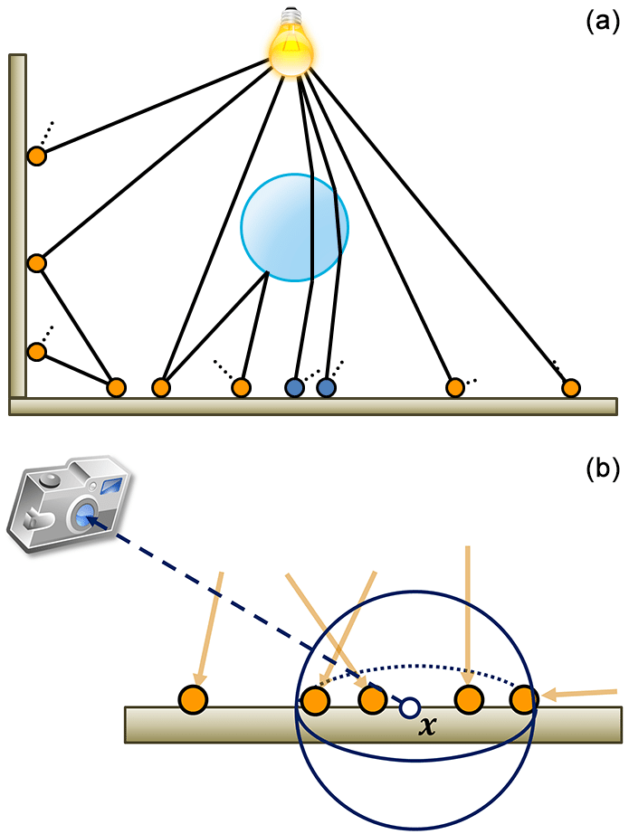
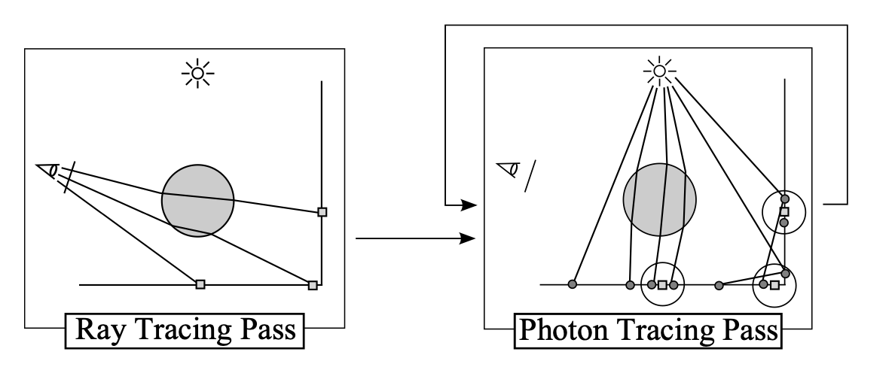
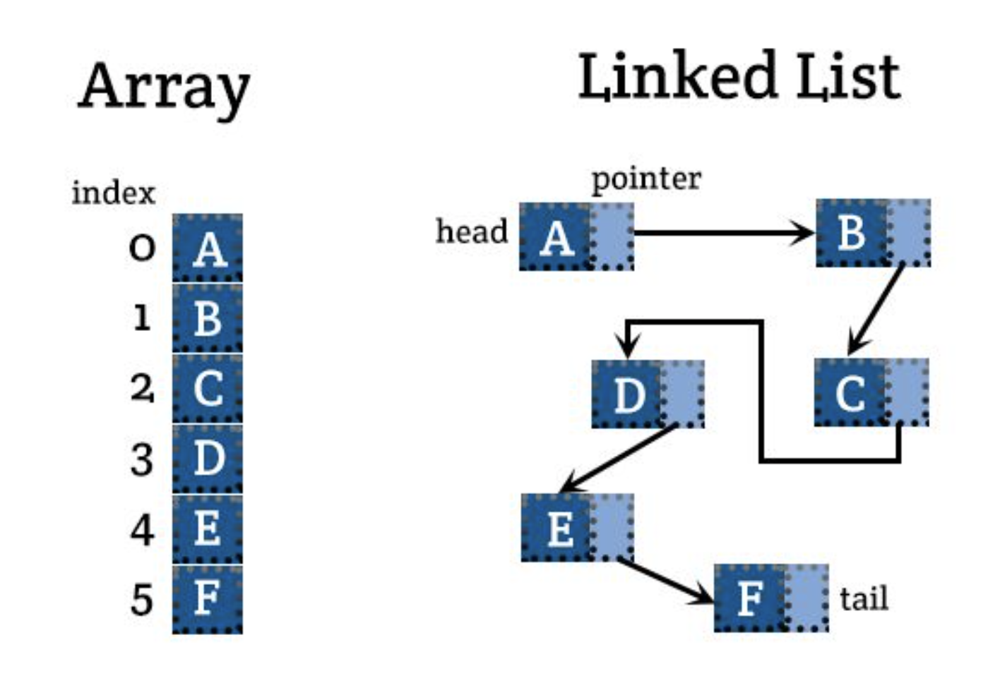
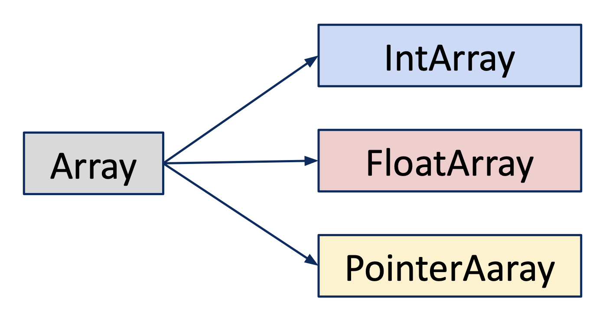

SPPM-CPU-Optimization
=====================================
**Authors: Kehan Xu ([LinkedIn](https://www.linkedin.com/in/kehan-xu-356139159/) | [Github](https://github.com/Fiona730) | [Personal Website](https://fiona730.github.io)), Zijun Hui ([LinkedIn](https://www.linkedin.com/in/kehan-xu-356139159/) | [Github](https://github.com/Fiona730)), Fengshi Zheng ([Github](https://github.com/JamesZFS)) and Hongyu He**

<p align="center"></p>

This is our group project for [Advanced Systems Lab](https://acl.inf.ethz.ch/teaching/fastcode/2022/) at ETH Zurich, the task of which is to implement one algorithm in C and perform CPU optimization. The algorithm of our choice is famous in the field of physically-based rendering: [stochastic progressive photon mapping](Stochastic Progressive Photon Mapping) (SPPM). We analyzed the bottleneck of our program and applied multiple stages of optimization. Due to the need of SPPM to store visible points in each iteration, this application is heavily memory-bound rather than compute-bound. The final result is a fully-vectorized algorithm with Intel intrinsics, and cache misses are minimized through changing data structure layout.

Besides this README, you can refer to [report](img/Report.pdf) and [presentation](img/Presentation.pdf) for more details.

The program is tested to run on all platforms (macOS, Linux, Windows). It proudly earns an outstanding grade of 95 out of 100.

## Table of Contents
[Stochastic Progressive Photon Mapping](#stochastic-progressive-photon-mapping)

[Optimization](#optimization)

[Performance Analysis](#performance-analysis)

[Build and Run Instructions](#build-and-run-instructions)

<a name="stochastic-progressive-photon-mapping"/> 

## Stochastic Progressive Photon Mapping

### Rendering Algorithm
Physically-based rendering algorithms are based on the theory of [rendering equation](https://en.wikipedia.org/wiki/Rendering_equation). Each method present its own way of simulating light transport in scene to estimate the integral inside the rendering equation as accurate as possible.

### Photon Mapping
[Photon mapping](https://en.wikipedia.org/wiki/Photon_mapping) is a two-pass rendering algorithm. The program first emits photons from light into the scene, then shoots camera rays to gather photons and estimate incident radiance. Photons and camera rays together form a "connection" from camera to light, through [kernel density estimation](https://en.wikipedia.org/wiki/Kernel_density_estimation) of photons to yield radiance estimate at camera ray intersection points.

<p align="center"></p>
<p align="center"><i>Two-pass Photon Mapping Algorithm.
<a href="https://www.researchgate.net/publication/317224001_Physically_based_computer_graphics_for_realistic_image_formation_to_simulate_optical_measurement_systems">Reference</a>.</i></p>

Photon mapping is especially effective in generating "difficult-to-sample" light paths, such as [caustics](https://en.wikipedia.org/wiki/Caustic_(optics)). Photons are reused across multiple camera rays, making the algorithm computationally efficient. On the other hand, these photons should be stored in memory throughout the second ray-shooting pass, so the memory size limits the maximum number of photons and therefore the accuracy of the algorithm. 

### Progressive Photon Mapping
[Progressive photon mapping](http://graphics.ucsd.edu/~henrik/papers/progressive_photon_mapping/progressive_photon_mapping.pdf) (PPM) is a multi-pass algorithm with a first ray-tracing pass followed by any number of photon-tracing passes. Similar to storing photons in photon mapping, in PPM we store where camera rays hit the scene to be visible points. In each following photon tracing pass, we emit new photons and progressively shrink the density estimation kernel, By aggregating gathered radiance over all iterations, we achieve convergence of the final rendered image.

<p align="center"></p>
<p align="center"><i>Reference from PPM paper.</i></p>

### Stochastic Progressive Photon Mapping
PPM needs to store not photons but visible points, so the memory issue still exists. To finally circumvent this problem, [stochastic progressive photon mapping](http://graphics.ucsd.edu/~henrik/papers/sppm/stochastic_progressive_photon_mapping.pdf) (SPPM) is proposed. Ray-tracing and photon-tracing passes are alternated for multiple rounds, and each iteration generates its own visible points / photons.

<p align="center"></p>
<p align="center"><i>Reference from SPPM paper.</i></p>

### Pseudocode
As described above, SPPM algorithm runs multiple iterations. Each loop is divided into 4 steps: `CameraPass()` traces ray from the camera, `BuildLookUpTable()` stores visible points into the spatial data structure, `PhotonPass()` traces photons from light sources and queries nearby visible points for each photon, `Consolidate()` updates the radiance information for each pixel based on the gathered information in `PhotonPass()`.

```c++
InitializeDataStructure()

For each iteration:
    CameraPass()
    BuildLookUpTable()
    PhotonPass()
    Consolidate()
    
StorePixelValue()
```

<a name="optimization"/> 

## Optimization
In order to fully exploit the potential of optimization, the whole program is implemented from scratch, down to the vector algebra library and array interface (cannot use C++ STL as we are using C). The only external library we rely on is [OpenEXR](https://openexr.com/en/latest/), for outputting the rendered image as EXR file format.

The first three optimization stages focus on optimizing the non-vectorized version of SPPM, and most part of the code is in `src/algorithm/sppm_s.c`. It is a good starting point if you want to understand the vectorized version, so I suggest you to look at it first. The rest part of optimization works on creating a performant hardware-parallelized SPPM, and `src/algorithm/sppm.c` shows the finalized outcome.

### Analysis

We face several challenges when optimizing a rendering algorithm such as SPPM:

* The program requires **complex data structure**, including the spatial structure to store visible points, as well as the structures to describe meshes and intersections.

* Light transport algorithms typically display **stochastic behaviour**. Adjacent rays can have varying behaviour: hitting different materials leads to differing bouncing logic. Therefore, a lot of if statements show up in the code, and it is hard to exploit locality.

* The huge amount of stores and loads induces **memory bottleneck**. The entries of our large spatial data structure can reference memory locations far away from each other, therefore careful consideration should be taken when designing the data structure layout and access patterns.

### Stage 1
Optimizations in stage 1 are straightforward and self-explanatory.

* Inline all vector math operations
  * Remove the function call overhead
* Improve spatial data structure
  * From linked-list to array
  * Allocate array space at the start of our program and reuse, instead of reallocating in each iteration
<p align="center"></p>

### Stage 2
* Inline short but frequently-called functions
  * E.g. array access and setting functions, ray generation, reflectance evaluation
* Type-specific Array
  * Type: Int, Float, Point, Vector
  * The baseline implementation only includes generic array which stores pointers to target data. Memcpy is called whenever setting array values, even for short segments of memory. Since most of the arrays store simple variable types, type specific arrays are a better choice.
  <p align="center"></p>
* Avoid unnecessary branching
  * Same if statement appear in consecutive for loops in `BuildLookUpTable()`
  * Store the results to circumvent redundant computation

### Stage 3
* Replace built-in `rand()` with self-implemented RNG to gain speed up
  * [Xorshift] (https://en.wikipedia.org/wiki/Xorshift) RNG
  * Extremely efficient, take less than 10 cycles per random number
  * (Disadvantage: Non cryptographically secure)
* Extend Xorshift to SIMD version
  * Generate 64 floats at a time, store them in a pool, take from the pool when needed
  * Compute 8 32-bit numbers per SIMD __m256i register simultaneously
  * Unroll the loop 8 times in one generation (8 * 8 = 64)

### Stage 4
### Stage 5
### Bonus

SPPM algorithm contains a hyperparameter that controls the hash table grid resolution (`_SPPM_RADIUS_MULT`). Tuning the parameter leads to different performance, and the optimal value is scene-specific. Just for fun, we apply [bayesian optimization](https://en.wikipedia.org/wiki/Bayesian_optimization) as an auto-tuning infrastructure to explore the ideal grid resolution (a continuous variable) for our test scene.

This optimization is not exactly targeted at boosting CPU performance, but rather changes the algorithm itself. Surprisingly, it improves speed up to 7.42%.

<a name="performance-analysis"/> 

## Performance Analysis

<a name="build-and-run-instructions"/> 

## Build and Run Instructions
### Build
```c++
mkdir build
cd build
cmake -DCMAKE_BUILD_TYPE=Release ..
make -j4
```
### Usage
```c++
./main [options] output_path

Options:
-w --width             image width
-h --height            image height
-i --iterations        number of iterations (sample per pixel for path tracing)
-d --depth             ray max depth
-p --photons_per_iter  number of photons per iteration
-r --init_radius       initial search radius
-a --algorithm         integrator: "pt" for path tracing, "sppm" for photon mapping (sequential version), "sppm-simd" for photon mapping (SIMD version, default), or "normal" for quick visualization
-s --scene             test scene: "cornell", "large", "mirror", "random", "surgery"
--help                 print this help text
```