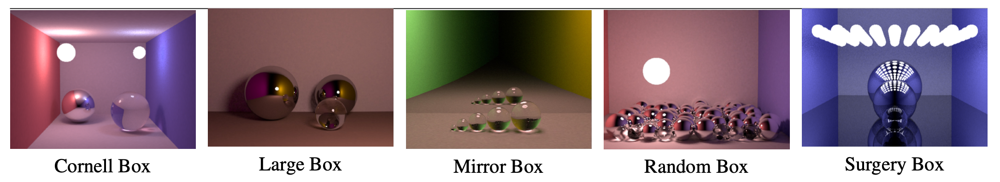

SPPM-CPU-Optimization
=====================================
**Kehan Xu ([LinkedIn](https://www.linkedin.com/in/kehan-xu-356139159/) | [Github](https://github.com/Fiona730) | [Personal Website](https://fiona730.github.io)), Zijun Hui ([LinkedIn](https://www.linkedin.com/in/kehan-xu-356139159/) | [Github](https://github.com/Fiona730)), Fengshi Zheng ([Github](https://github.com/JamesZFS)) and Hongyu He**

## Table of Contents
[Stochastic Progressive Photon Mapping](#stochastic-progressive-photon-mapping)

[Optimization](#optimization)

[Performance Analysis](#performance-analysis)

[Build Instructions](#build-instructions)

<a name="stochastic-progressive-photon-mapping"/> 

## Stochastic Progressive Photon Mapping

<a name="optimization"/> 

## Optimization

<a name="performance-analysis"/> 

## Performance Analysis

<a name="build-instructions"/> 

## Build Instructions