SPPM-CPU-Optimization
=====================================
**Authors: Kehan Xu ([LinkedIn](https://www.linkedin.com/in/kehan-xu-356139159/) | [Github](https://github.com/Fiona730) | [Personal Website](https://fiona730.github.io)), Zijun Hui ([LinkedIn](https://www.linkedin.com/in/kehan-xu-356139159/) | [Github](https://github.com/Fiona730)), Fengshi Zheng ([Github](https://github.com/JamesZFS)) and Hongyu He**

<p align="center"></p>

This is our group project for [Advanced Systems Lab](https://acl.inf.ethz.ch/teaching/fastcode/2022/) at ETH Zurich, the task of which is to implement one algorithm in C and perform CPU optimization. The algorithm of our choice is famous in the field of physically-based rendering: [stochastic progressive photon mapping](Stochastic Progressive Photon Mapping) (SPPM). We analyzed the bottleneck of our program and applied multiple stages of optimization. Due to the need of SPPM to store visible points in each iteration, this application is heavily memory-bound rather than compute-bound. The final result is a fully-vectorized ([SIMD](https://en.wikipedia.org/wiki/Multiple_instruction,_single_data)) algorithm with Intel intrinsics, and cache misses are minimized through changing data structure layout. It achieves up to a **22.69x** speedup ovr the baseline implementation.

Besides this README, you can refer to [report](img/Report.pdf) and [presentation](img/Presentation.pdf) for more details.

The program is tested to run on all platforms (macOS, Linux, Windows). It proudly earns an outstanding grade of 95 out of 100.

## Table of Contents
[Stochastic Progressive Photon Mapping](#stochastic-progressive-photon-mapping)

[Optimization](#optimization)

[Performance Analysis](#performance-analysis)

[Build and Run Instructions](#build-and-run-instructions)

[Reference](#reference)

<a name="stochastic-progressive-photon-mapping"/> 

## Stochastic Progressive Photon Mapping

### Rendering Algorithm
Physically-based rendering algorithms are based on the theory of [rendering equation](https://en.wikipedia.org/wiki/Rendering_equation). Each method present its own way of simulating light transport in scene to estimate the integral inside the rendering equation as accurate as possible.

### Photon Mapping
[Photon mapping](https://en.wikipedia.org/wiki/Photon_mapping) is a two-pass rendering algorithm. The program first emits photons from light into the scene, then shoots camera rays to gather photons and estimate incident radiance. Photons and camera rays together form a "connection" from camera to light, through [kernel density estimation](https://en.wikipedia.org/wiki/Kernel_density_estimation) of photons to yield radiance estimate at camera ray intersection points.

<p align="center"></p>
<p align="center"><i>Two-pass Photon Mapping Algorithm.
<a href="https://www.researchgate.net/publication/317224001_Physically_based_computer_graphics_for_realistic_image_formation_to_simulate_optical_measurement_systems">Reference</a>.</i></p>

Photon mapping is especially effective in generating "difficult-to-sample" light paths, such as [caustics](https://en.wikipedia.org/wiki/Caustic_(optics)). Photons are reused across multiple camera rays, making the algorithm computationally efficient. On the other hand, these photons should be stored in memory throughout the second ray-shooting pass, so the memory size limits the maximum number of photons and therefore the accuracy of the algorithm. 

### Progressive Photon Mapping
[Progressive photon mapping](http://graphics.ucsd.edu/~henrik/papers/progressive_photon_mapping/progressive_photon_mapping.pdf) (PPM) is a multi-pass algorithm with a first ray-tracing pass followed by any number of photon-tracing passes. Similar to storing photons in photon mapping, in PPM we store where camera rays hit the scene to be visible points. In each following photon tracing pass, we emit new photons and progressively shrink the density estimation kernel, By aggregating gathered radiance over all iterations, we achieve convergence of the final rendered image.

<p align="center"></p>
<p align="center"><i>Reference from PPM paper.</i></p>

### Stochastic Progressive Photon Mapping
PPM needs to store not photons but visible points, so the memory issue still exists. To finally circumvent this problem, [stochastic progressive photon mapping](http://graphics.ucsd.edu/~henrik/papers/sppm/stochastic_progressive_photon_mapping.pdf) (SPPM) is proposed. Ray-tracing and photon-tracing passes are alternated for multiple rounds, and each iteration generates its own visible points / photons.

<p align="center"></p>
<p align="center"><i>Reference from SPPM paper.</i></p>

### Pseudocode
As described above, SPPM algorithm runs multiple iterations. Each loop is divided into 4 steps: `CameraPass()` traces ray from the camera, `BuildLookUpTable()` stores visible points into the spatial data structure, `PhotonPass()` traces photons from light sources and queries nearby visible points for each photon, `Consolidate()` updates the radiance information for each pixel based on the gathered information in `PhotonPass()`.

```c++
InitializeDataStructure()

For each iteration:
    CameraPass()
    BuildLookUpTable()
    PhotonPass()
    Consolidate()
    
StorePixelValue()
```

If you are interested in looking at the code, a more detailed version of pseudocode might be helpful.
<p align="center">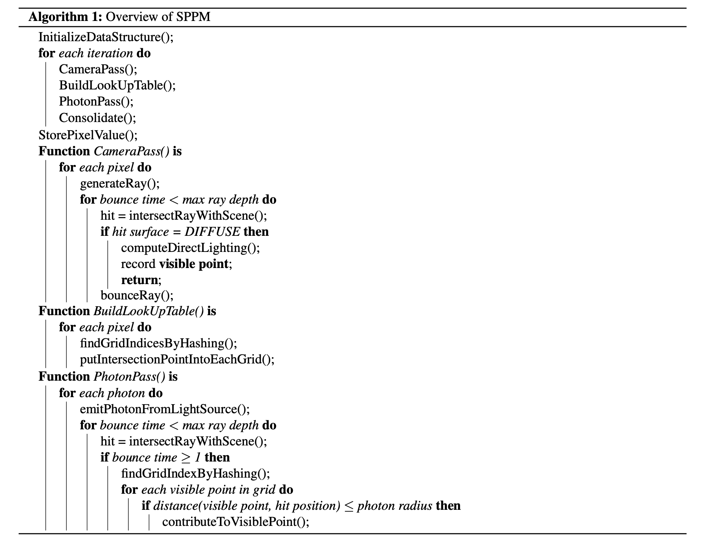</p>

<a name="optimization"/> 

## Optimization
In order to fully exploit the potential of optimization, the whole program is implemented from scratch, down to the vector algebra library and array interface (cannot use C++ STL as we are using C). The only external libraries we rely on are [OpenEXR](https://openexr.com/en/latest/), for outputting the rendered image as EXR file format, and [AVX-optimized trigonometric math functions](https://github.com/reyoung/avx_mathfun), as a substitute for native SIMD implementation when Intel’s [Short Vector Math Library Operations](https://www.intel.com/content/www/us/en/docs/cpp-compiler/developer-guide-reference/2021-8/intrinsics-for-short-vector-math-library-ops.html) (SVML) is not available in certain operating system.

As the focus of this project is on optimization, we try to keep the base algorithm succinct. We only use sphere for objects and lights so as to simplify the intersection logic; only 3 basic types of material are supported: diffuse, specular and dielectric. Float precision is enough for our application.

The first three optimization stages focus on optimizing the non-vectorized version of SPPM, and most part of the code is in `src/algorithm/sppm_s.c`. It is a good starting point if you want to understand the vectorized version, so I suggest you to look at it first.

The rest part of optimization works on creating a performant SIMD-paralleled SPPM. [Single data multiple instruction](https://en.wikipedia.org/wiki/Multiple_instruction,_single_data) (SIMD) is the widespread parallel computing architecture that executes the same instruction set on multiple data stored inside a register. `src/algorithm/sppm.c` shows the final accelerated version.

**The snapshot of each optimization stage is also stored in a separate branch (stage 0-5, stage 6 correspoinds to the main branch).**

### Analysis at [Stage 0](https://github.com/Fiona730/SPPM-CPU-Optimization/tree/stage-0)

We face several challenges when optimizing a rendering algorithm such as SPPM:

* The program requires **complex data structure**, including the spatial structure to store visible points, as well as the structures to describe meshes and intersections.

* Light transport algorithms typically display **stochastic behaviour**. Adjacent rays can have varying behaviour: hitting different materials leads to differing bouncing logic. Therefore, a lot of if statements show up in the code, and it is hard to exploit locality.

* The huge amount of stores and loads induces **memory bottleneck**. The entries of our large spatial data structure can reference memory locations far away from each other, therefore careful consideration should be taken when designing the data structure layout and access patterns.

### [Stage 1](https://github.com/Fiona730/SPPM-CPU-Optimization/tree/stage-1)
Optimizations in stage 1 are straightforward and self-explanatory.

* Inline all vector math operations
  * Remove the function call overhead
* Improve spatial data structure
  * From linked-list to array
  * Allocate array space at the start of our program and reuse, instead of reallocating in each iteration
<p align="center"></p>

### [Stage 2](https://github.com/Fiona730/SPPM-CPU-Optimization/tree/stage-2)
* Inline short but frequently-called functions
  * E.g. array access and setting functions, ray generation, reflectance evaluation
* Type-specific Array
  * Type: Int, Float, Pointer, Vector
  * The baseline implementation only includes generic array which stores pointers to target data. `Memcpy` is called whenever setting array values, even for short segments of memory. Since most of the arrays store simple variable types, type specific arrays are a better choice.
  <p align="center"></p>
* Avoid unnecessary branching
  * Same if statement appear in consecutive for loops in `BuildLookUpTable()`
  * Store the results to circumvent redundant computation

### [Stage 3](https://github.com/Fiona730/SPPM-CPU-Optimization/tree/stage-3)
* Replace built-in `rand()` with self-implemented RNG to gain speed up
  * [Xorshift] (https://en.wikipedia.org/wiki/Xorshift) RNG
  * Extremely efficient, take less than 10 cycles per random number
  * (Disadvantage: Non cryptographically secure)
* Extend Xorshift to SIMD version
  * Generate 64 floats at a time, store them in a pool, take from the pool when needed
  * Compute 8 32-bit numbers per SIMD **__m256i** (SSE 256 bit register for integer) simultaneously
  * Unroll the loop 8 times in one generation (8 * 8 = 64)

### [Stage 4](https://github.com/Fiona730/SPPM-CPU-Optimization/tree/stage-4)
Starting from this point, we transform our SPPM algorithm to maximally SIMD architecture with [Intel intrinsics](https://www.intel.com/content/www/us/en/docs/intrinsics-guide/index.html).

#### Horizontal Layout Vector (Failed Attempt)
Our first attempt on vectorization tries out the horizontal layout, where each 3-dimensional vector is represented by one **__m128** (XMM 128 bit register).

Though an intuitive attempt, it is not further pursued due to the following disadvantages:
* Each vector contains an unused entry, waste memory
* Parallel infeasible for vector operations with dimension reduction: dot product, cross product, norm computation etc.
  * (Straightforward for elementwise vector operations such as add)
* Hinders the extension to make the rest of the SPPM algorithm parallel
* Show no performance improvement on Intel Skylake processor

#### Vertical Layout Vector
In vertical layout, the x, y, z component of a 3-dimensional vector are placed into separate **__m256** registers, and each register stores the x / y / z component of 8 vectors. In other words, 8 vectors are stored compactly into 3 **__m256** variables, and no space in register is wasted. See a comparison of both layouts in the graph below. With such representation, the whole SPPM algorithm is then rewritten with SIMD instructions (the code became hard to read and debugging was a bit painful).

<p align="center">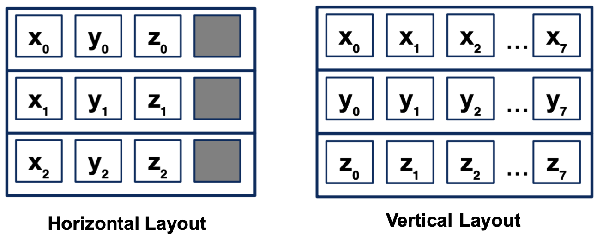</p>

#### SPPM Vectorization
As a preceding step for whole algorithm vectorization, the layout of key data structures changes from array of structures (AoS) to structure of arrays (SoA) (see a simple introduction [here](https://www.geeksforgeeks.org/array-of-structures-vs-array-within-a-structure-in-c-and-cpp/)). This not only simplifies loads and reads with SIMD instructions, but storing elements of the same property contiguously in memory also brings the benefit of better spatial coherency.

During the camera pass, the vectorized algorithm shots eight rays at the same time. The rays will likely diverge through hitting different geometries, making branching necessary; we execute all possible code paths and blend results together with Boolean masks (this is similar to if branching for warps on GPU, just that we're doing manually in our code). The hash table structure is adjusted to read and write 8 pixels in parallel.

Regarding the photon pass, processing 8 photons together would be inefficient because the number of hash table entries may vary drastically across different photons, and all photons need to wait for the one with most entries. Instead, we process photons sequentially and utilize SIMD architecture for spatial hash table entries traversal. For one given photon, 8 hash table entries are loaded simultaneously. Data are read and written according to those hash table entries; as they are almost always non-continuous, this procedure involves data gathering and scattering operation in the vectorized algorithm.

#### Slowdown
After SPPM parallelization, our program actually suffers from a decrease in running speed. After observation, we believe the culprit of slowing down is the gathering and scattering operations inside the photon pass (mentioned above). Since the data structure has previously been converted to the SoA layout for convenience, gathering 16 elements with the same index from different arrays (i.e. in AoS, they are from the same struct) would imply up to 16 cache misses. As each photon gathers value from a group of different pixels, it is highly likely that there is little data reuse and proximity within this process, resulting in almost no temporal or spatial cache locality.

### [Stage 5](https://github.com/Fiona730/SPPM-CPU-Optimization/tree/stage-5)
This stage focuses on resolving the slowdown issue in the vectorized SPPM algorithm induced by scattering and gathering operations. To reduce the number of cache misses, we transform the strict SoA layout into a hybrid layout of SoA and AoS. The data necessary for each gather operations are in total 16 floats; they are grouped together in a struct and stored in a cache aligned array. This way, during the gather operation, only one cache line read is needed. A graphical explanation of this layout change can be found in the graph below.

<p align="center">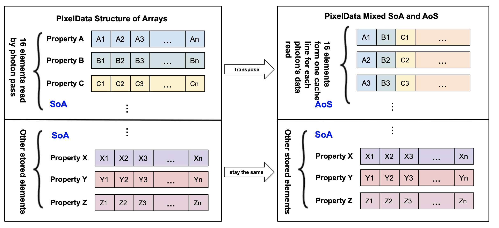</p>

To convert the 16 read elements from the previous horizontal (SoA) format into the vertical layout (AoS) requires two 8 x 8 transpositions. Performing matrix transpose in a cache-friendly way is a topic taught and practiced in class.

Similar to gathering, a hybrid layout is also used for scattering, storing only the 4 output variables in an AoS layout by transpose and reducing the number of cache misses by a factor of 4. This requires a 4 x 8 transpose operation. Experiments show that the performance gain worth the overhead of matrix transpose (see Performance Analysis section).

### [Stage 6](https://github.com/Fiona730/SPPM-CPU-Optimization/tree/main)
Even after the massive amount of coding in stage 5, the program is still memory-bound. We turn to remove redundancy in variables needed to gather, eliminating the total number from 16 to 8. The analysis strongly entangles with the code details, and the inspiration it provides for general CPU program optimization is rather limited. If you are interested, please refer to Section 3.8 in the [report](img/Report.pdf).

<p align="center">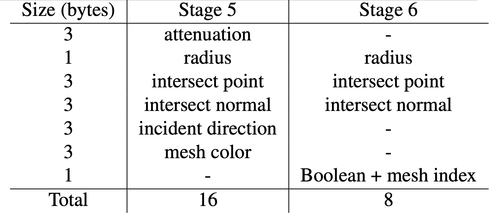</p>

### Bonus

SPPM algorithm contains a hyperparameter that controls the hash table grid resolution (`_SPPM_RADIUS_MULT`). Tuning the parameter leads to different performance, and the optimal value is scene-specific. Just for fun, we apply [bayesian optimization](https://en.wikipedia.org/wiki/Bayesian_optimization) as an auto-tuning infrastructure to explore the ideal grid resolution (a continuous variable) for our test scene.

This optimization is not exactly targeted at boosting CPU performance, but rather changes the algorithm itself. Surprisingly, it improves speed up to 7.42%.

<a name="performance-analysis"/> 

## Performance Analysis

### Experiment setup
| Component | Specification  |
| ----------------------- | ------------------- |
| CPU | Intel Core i9-10850K Processor @ 3.60 GHz |
| Microarchitecture | Skylake |
| L1 cache | 64 KB |
| L2 cache | 256 KB |
| L3 cache | 20 MB |
| DRAM | 32 GB |
<i>Note that L1 and L2 cache are on a per-core basis.</i>

* Both turbo-boost and hyper-threading were turned off and caches were cleared prior to each run.

* The compiler used for clang 14.0.0, with flags `-O3, -ffast-math, -march=native`. 

* Without vectorization, the device has a peak performance of 4 flops/cycle. With vectorization for single-precision floating-points, 32 flops of cycle was reached.

### Results
Results were obtained using Intel’s [Vtune Profiler](https://www.intel.com/content/www/us/en/developer/tools/oneapi/vtune-profiler.html).

We demonstrate results for multiple test scenes. The default parameters are: image size p = 512 × 384, number of iterations n = 6, ray max depth d = 5, number of photons per iteration l = 200000.

#### Relative Speedup
In each of the following experiments, only one parameter is modified. The ray max depth is kept constant.

<p align="center">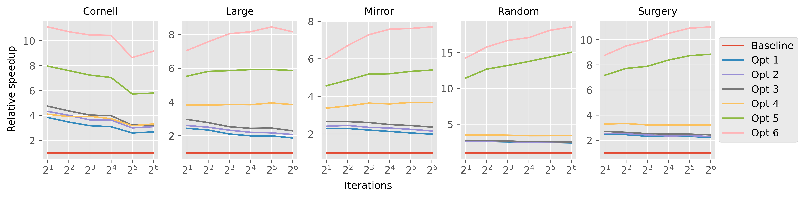</p>
<p align="center"><i>Performance gain of each optimization stage when sweeping the number of photons. <br>Number of iterations ranged from 2 to 64 with increments by a power of 2.</i></p>

<p align="center">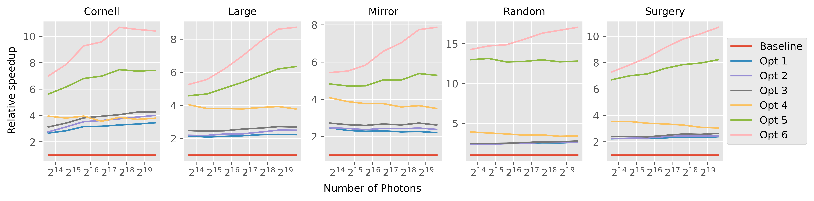</p>
<p align="center"><i>Performance gain of each optimization stage when sweeping the number of iterations. <br>Number of photons per iteration ranged from 12500 to 800000 with increments by a power of 2.</i></p>

<p align="center">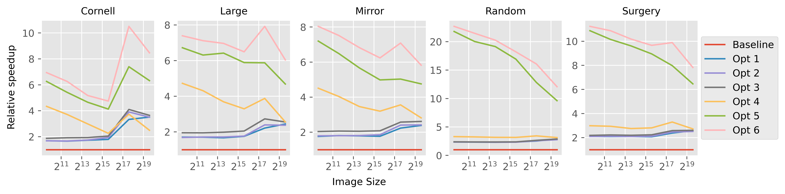</p>
<p align="center"><i>Performance gain of each optimization stage when sweeping the image size. <br>Image sizes ranged from 32 × 24 to 1024 × 768 with increments by a power of 2.</i></p>

The various optimization stages gradually increase the relative speedup compared to the baseline. The largest jumps are caused by stage 1, stage 5, and stage 6. Note that these stages focus on optimizing for memory transfers, suggesting the SPPM algorithm is inherently memory bound. The improvement is greatest in complex scenes "random" and "surgery". This is likely due to the increased complexity of the spatial hash table, which is focused on in the later optimization stages.

As the number of iterations increases, the relative speedup in the last stage increases. In higher iterations, the radius becomes smaller and the hash table more sparse, making memory transfers more dominant in affecting program efficiency. Similarly, the final stage speedup increases as the number of photons increases, since the spatial hash table is used more heavily. However, when the image size increases, the speedup decreases. This is likely due to the larger proportion spent in the camera pass, which is not identified as the bottleneck and already gains significant speed up by parallelization with SIMD.

Overall, on the tested scenes and input parameters, a maximum speedup of 22.69× is observed. Given the trend, it is reasonable to assume that a greater speedup can be observed on complex scenes, high number of photons, and a large number of iterations. This setup is commonly used to obtain images with low noise, suggesting the algorithm generalises well to the commonly used scenarios.

#### Flops Per Cycle
<p align="center">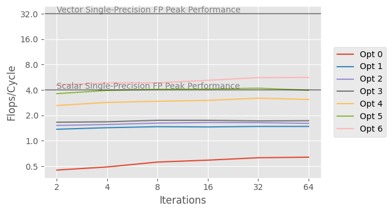</p>
<p align="center"><i>The number of Flops per cycle executed for the "Cornell" scene with varying number of iterations.</i></p>

Recall that the first three stages and baseline are implemented without SIMD intrinsics, and only the compiler may select to use them in some cases. After manually using SIMD intrinsics, there is a 72.02% increase in the number of flops per cycle. Note that this does not translate to reduced runtime, since redundant computations were made during ray masking. The final iteration obtains a maximum flops per cycle of 5.63, which is 17.6% of the theoretical peak maximum. Overall, a 9.56× increase in computation was observed. Most notably, this is higher than the theoretical scalar maximum of 4, suggesting that the final vectorized version is faster than any scalar algorithm possible.

Increasing the iteration number do not affect the flops per cycle significantly. This is because cache usage is independent of the number of iterations.

#### Roofline Plot

[Roofline model](https://en.wikipedia.org/wiki/Roofline_model) is a graph to intuitively visualize the performance of a program, with operational intensity (FLOPS/byte) as X axis and performance (GFLOPS) as Y axis. By observing the Roofline plot, one can know whether the program is memory- or compute- bound by comparing with the two boundaries based on bandwidth and peak performance.

Here we show Roofline plots for stage 0, 4 and 6.

<p align="center">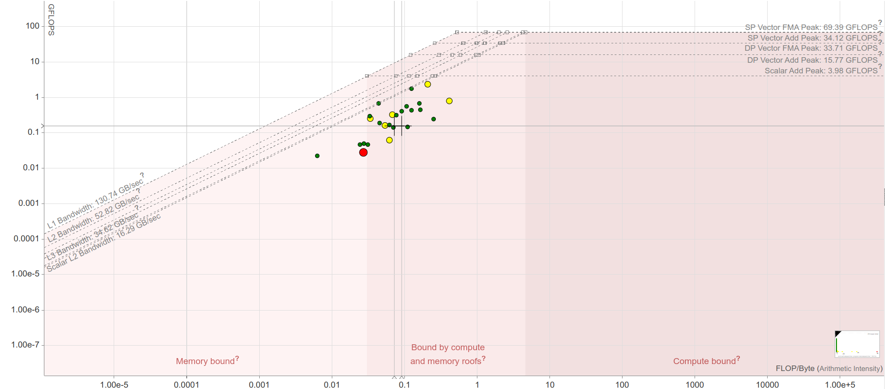</p>
<p align="center">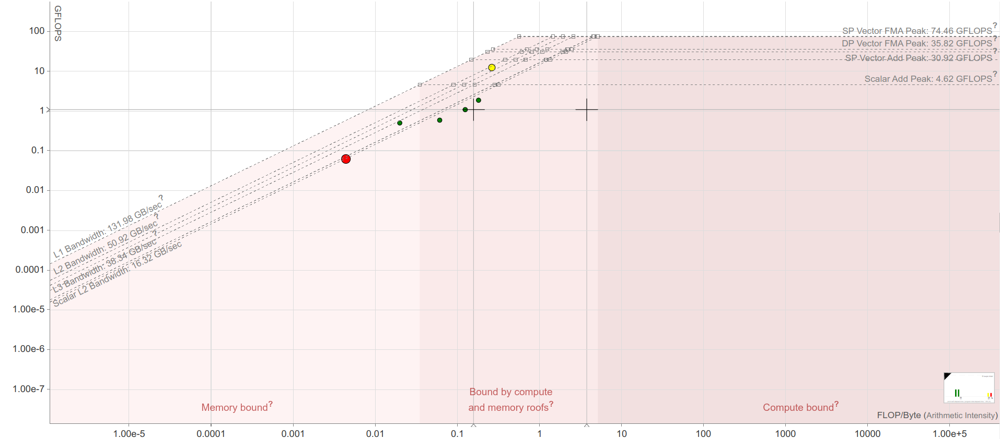</p>
<p align="center">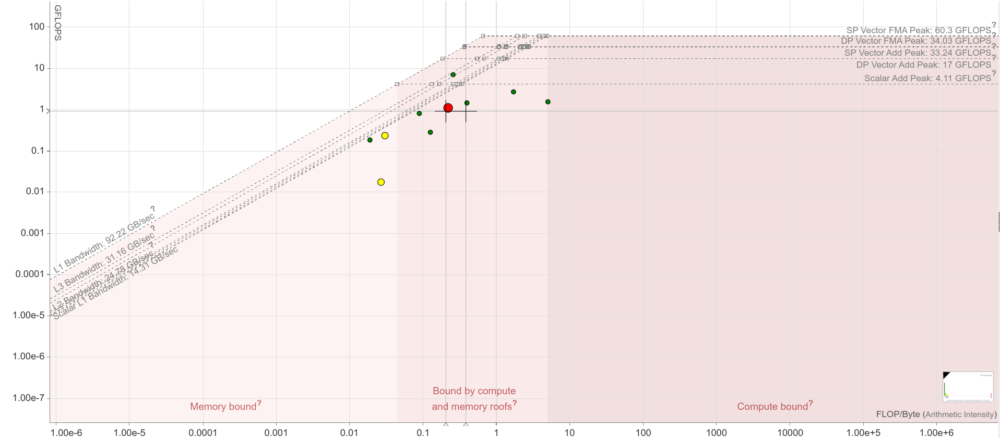</p>

We conclude that all the optimization stages are still relatively memory-bound, since the operational intensity is smaller than the intersection point of memory bound and computation bound.

<a name="build-and-run-instructions"/> 

## Build and Run Instructions
### Build
```c++
mkdir build
cd build
cmake -DCMAKE_BUILD_TYPE=Release ..
make -j4
```
### Usage
```c++
./main [options] output_path

Options:
-w --width             image width
-h --height            image height
-i --iterations        number of iterations (sample per pixel for path tracing)
-d --depth             ray max depth
-p --photons_per_iter  number of photons per iteration
-r --init_radius       initial search radius
-a --algorithm         integrator: "pt" for path tracing, "sppm" for photon mapping (sequential version), "sppm-simd" for photon mapping (SIMD version, default), or "normal" for quick visualization
-s --scene             test scene: "cornell", "large", "mirror", "random", "surgery"
--help                 print this help text
```

<a name="Reference"/> 

## Reference
[Intel Intrinsics Guide](https://www.intel.com/content/www/us/en/docs/intrinsics-guide/index.html)

[Advanced Systems Lab Lecture](https://acl.inf.ethz.ch/teaching/fastcode/2022/)

[Stochastic Progressive Photon Mapping](http://graphics.ucsd.edu/~henrik/papers/sppm/)

[AVX-optimized sin(), cos(), exp() and log() functions](https://github.com/reyoung/avx_mathfun)